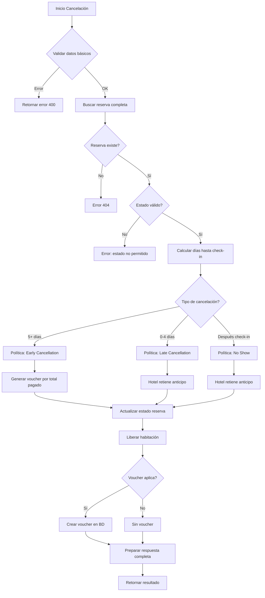

# 📋 Documentación Completa del Flujo de Cancelaciones

## 🎯 Resumen Ejecutivo

El sistema de cancelaciones de BaluHotel maneja tres escenarios principales basados en el tiempo de anticipación antes del check-in:

1. **✅ Cancelación anticipada** (5+ días antes): Cliente recibe voucher de crédito por 30 días
2. **⚠️ Cancelación tardía** (0-4 días antes): Hotel retiene el anticipo
3. **❌ No Show** (después del check-in): Hotel retiene el anticipo

---

## 🔄 Flujo General de Cancelación

### 1. Validación Previa (`validateCancellation`)

**Endpoint:** `POST /bookings/:bookingId/validate-cancellation`

**Ubicación:** `BackBalu/src/controllers/bookingController.js` (línea ~8072)

#### Proceso:
```javascript
1. Buscar reserva con datos completos (Room, Buyer, Payments)
2. Validar que el estado sea: 'confirmed', 'paid', o 'pending'
3. Calcular días hasta el check-in
4. Determinar políticas aplicables
5. Calcular montos de reembolso/crédito
6. Retornar resultado de validación
```

#### Respuesta de validación:
```javascript
{
  canCancel: boolean,
  policies: {
    cancellation: { type, description, allowsModification },
    refund: { type, amount, reason },
    creditVoucher: { type, amount, validityDays, validUntil }
  },
  financial: {
    totalAmount: number,
    totalPaid: number,
    estimatedRefund: number,
    estimatedCredit: number
  },
  warnings: string[],
  errors: string[]
}
```

---

### 2. Ejecución de Cancelación (`cancelBooking`)

**Endpoint:** `PUT /bookings/:bookingId/cancel`

**Ubicación:** `BackBalu/src/controllers/bookingController.js` (línea ~6926)

#### Parámetros requeridos:
```javascript
{
  reason: string,              // OBLIGATORIO
  requestType: string,         // 'cancellation' | 'date_change' | 'credit_voucher'
  newCheckIn: date,           // Solo para date_change
  newCheckOut: date,          // Solo para date_change
  notes: string               // Opcional
}
```

#### Proceso completo:



---

## 📊 Políticas de Cancelación Detalladas

### Política 1: Cancelación Anticipada (5+ días)

```javascript
{
  type: "early_cancellation",
  description: "Cancelación con más de 5 días de anticipación",
  allowsModification: true,
  allowsFullCancellation: true,
  refundType: "credit_voucher",
  
  // ✅ BENEFICIOS
  creditVoucher: {
    amount: totalPaid,           // 100% del monto pagado
    validityDays: 30,            // Válido por 30 días calendario
    status: 'active',
    canBeUsed: true
  },
  
  // ❌ RESTRICCIONES
  refund: {
    type: "no_refund",
    amount: 0,
    reason: "Hotel Balú no realiza devoluciones de dinero"
  }
}
```

**Acciones del sistema:**
- ✅ Cambia estado de reserva a `cancelled`
- ✅ Libera la habitación (status: "Limpia", available: true)
- ✅ Crea voucher en tabla `vouchers` con:
  - `voucherCode`: Generado automáticamente (formato: BLU + timestamp + random)
  - `amount`: Total pagado
  - `validUntil`: Fecha actual + 30 días
  - `status`: 'active'
  - `guestId`: ID del huésped
  - `originalBookingId`: ID de la reserva cancelada

---

### Política 2: Cancelación Tardía (0-4 días antes)

```javascript
{
  type: "late_cancellation",
  description: "Cancelación con menos de 5 días de anticipación",
  allowsModification: false,
  allowsFullCancellation: true,
  refundType: "forfeit_payment",
  
  // ❌ SIN BENEFICIOS
  refund: {
    type: "forfeit",
    amount: 0,
    reason: "Cancelación tardía: el hotel se queda con el anticipo"
  },
  
  creditVoucher: {
    type: "forfeit",
    amount: 0,
    description: "No aplica crédito por cancelación tardía"
  }
}
```

**Acciones del sistema:**
- ✅ Cambia estado de reserva a `cancelled`
- ✅ Libera la habitación
- ❌ NO crea voucher
- 💰 Hotel retiene el anticipo

---

### Política 3: No Show (después del check-in)

```javascript
{
  type: "no_show",
  description: "Cancelación después de la fecha de check-in",
  allowsModification: false,
  allowsFullCancellation: true,
  refundType: "forfeit_payment",
  
  // ❌ SIN BENEFICIOS
  refund: {
    type: "forfeit",
    amount: 0,
    reason: "No show: el hotel se queda con el anticipo"
  },
  
  creditVoucher: {
    type: "forfeit",
    amount: 0,
    description: "No aplica crédito por no presentarse"
  }
}
```

---

## 💳 Sistema de Vouchers

### Generación de Vouchers

**Función:** `generateVoucherCode()`  
**Ubicación:** `BackBalu/src/controllers/bookingController.js` (línea ~85)

```javascript
function generateVoucherCode() {
  const prefix = 'BLU';                                    // Prefijo del hotel
  const timestamp = Date.now().toString().slice(-6);       // Últimos 6 dígitos del timestamp
  const random = Math.random().toString(36).substring(2, 6).toUpperCase(); // 4 caracteres random
  return `${prefix}${timestamp}${random}`;                 // Ejemplo: BLU123456ABCD
}
```

### Estructura del Voucher en Base de Datos

**Tabla:** `vouchers`  
**Modelo:** `BackBalu/src/data/models/Voucher.js`

```javascript
{
  voucherId: "VOUCHER-{bookingId}-{timestamp}",  // PK único
  voucherCode: "BLU123456ABCD",                  // Código de uso (único, indexado)
  amount: 140000.00,                             // Monto del crédito
  status: "active",                              // 'active' | 'used' | 'expired' | 'cancelled'
  guestId: "1234567890",                         // FK a Buyers
  originalBookingId: 123,                        // FK a Bookings (reserva que generó el voucher)
  usedBookingId: null,                           // FK a Bookings (reserva donde se usó)
  validUntil: "2025-11-14T23:59:59.000Z",       // Fecha de expiración (30 días)
  usedAt: null,                                  // Fecha cuando se usó
  usedBy: null,                                  // Quién lo usó
  createdBy: "staff_id_or_system",              // Quién lo creó
  notes: "Crédito por cancelación de reserva #123. Motivo: Cambio de planes",
  metadata: {                                    // Información adicional (JSON)
    originalCheckIn: "2025-10-20",
    originalCheckOut: "2025-10-22",
    originalAmount: 140000,
    cancelReason: "Cambio de planes",
    cancellationType: "early_cancellation",
    daysUntilCheckIn: 7,
    isStaffCancellation: false,
    cancelledAt: "2025-10-15T10:30:00.000Z"
  },
  createdAt: "2025-10-15T10:30:00.000Z",
  updatedAt: "2025-10-15T10:30:00.000Z"
}
```

---

## 🔍 Validación y Uso de Vouchers

### 1. Validar Voucher

**Endpoint:** `POST /vouchers/validate`  
**Controller:** `BackBalu/src/controllers/voucherControllers.js` (línea ~175)

**Request:**
```javascript
{
  voucherCode: "BLU123456ABCD",
  bookingId: 456,              // Opcional: reserva donde se quiere usar
  validateAmount: true,        // Validar si el monto es suficiente
  requiredAmount: 150000       // Monto requerido para la reserva
}
```

**Validaciones realizadas:**
1. ✅ Código existe en la BD
2. ✅ Estado es `active`
3. ✅ No está expirado (`validUntil >= now`)
4. ✅ Monto es suficiente (si `validateAmount = true`)

**Response:**
```javascript
{
  isValid: true,
  reason: "Voucher válido",
  voucher: {
    voucherId: "VOUCHER-123-1234567890",
    voucherCode: "BLU123456ABCD",
    amount: 140000,
    validUntil: "2025-11-14",
    status: "active",
    guest: { id, name, email },
    originalBooking: { bookingId, checkIn, totalAmount },
    daysUntilExpiry: 25
  }
}
```

---

### 2. Usar Voucher

**Endpoint:** `PUT /vouchers/:voucherId/use`  
**Controller:** `BackBalu/src/controllers/voucherControllers.js` (línea ~311)

**Request:**
```javascript
{
  bookingId: 456,              // OBLIGATORIO: Reserva donde se aplicará
  usedBy: "staff_id",         // Quién lo está usando
  notes: "Aplicado a nueva reserva",
  appliedAmount: 140000       // Opcional: puede ser parcial
}
```

**Proceso:**
1. Buscar voucher por ID
2. Validar que esté `active` y no expirado
3. Buscar reserva de destino
4. Actualizar voucher:
   ```javascript
   {
     status: 'used',
     usedAt: now,
     usedBy: 'staff_id',
     usedBookingId: 456,
     notes: 'Aplicado a nueva reserva'
   }
   ```
5. Actualizar reserva de destino (descontar del totalAmount)

---

## 🎨 Frontend - Componentes Principales

### 1. CancellationManager
**Archivo:** `FrontBalu/src/Components/Booking/CancellationManager.jsx`

**Responsabilidades:**
- Mostrar modal de cancelación
- Validar políticas antes de cancelar
- Ejecutar cancelación
- Mostrar resultado (incluyendo voucher generado)

**Estados (steps):**
- `confirm`: Confirmación inicial + razón de cancelación
- `policies`: Mostrar políticas aplicables y advertencias
- `processing`: Procesando cancelación

**Razones predefinidas:**
```javascript
const CANCEL_REASONS = [
  { value: 'change_of_plans', label: 'Cambio de planes' },
  { value: 'emergency', label: 'Emergencia' },
  { value: 'health_issues', label: 'Problemas de salud' },
  { value: 'work_conflict', label: 'Conflicto laboral' },
  { value: 'better_option', label: 'Encontré mejor opción' },
  { value: 'other', label: 'Otro motivo' }
];
```

---

### 2. VoucherManager
**Archivo:** `FrontBalu/src/Components/Booking/VoucherManager.jsx`

**Responsabilidades:**
- Listar vouchers del huésped
- Validar código de voucher
- Aplicar voucher a reserva
- Mostrar estado de vouchers (disponible, usado, expirado)

**Tabs:**
- `available`: Vouchers disponibles del usuario
- `validate`: Validar y usar un código de voucher

---

## 📱 Redux Actions

**Archivo:** `FrontBalu/src/Redux/Actions/bookingActions.jsx`

### Cancelación:
```javascript
getCancellationPolicies(bookingId)      // Obtener políticas
validateCancellation(bookingId, data)   // Validar antes de cancelar
cancelBooking(bookingId, cancelData)    // Ejecutar cancelación
clearCancellationState()                // Limpiar estado
getCancelledBookings(params)            // Listar canceladas
restoreBooking(bookingId)               // Restaurar cancelación
```

### Vouchers:
```javascript
getAllVouchers(params)                  // Listar todos los vouchers
validateVoucher(code, data)             // Validar voucher
useVoucher(voucherId, data)             // Usar voucher
getVoucherByCode(code)                  // Buscar por código
clearVoucherState()                     // Limpiar estado
```

---

## ⚠️ Casos Especiales y Consideraciones

### 1. Modificación de Fechas (Date Change)
```javascript
requestType: 'date_change'
```

**Requisitos:**
- ✅ Mínimo 5 días de anticipación
- ✅ Nuevas fechas válidas (futuras y consecutivas)
- ✅ Disponibilidad de la habitación en nuevas fechas

**Resultado:**
- Estado se mantiene en `confirmed`
- Se guardan fechas originales
- NO se libera la habitación
- NO se genera voucher

---

### 2. Error en Creación de Voucher

Si falla la creación del voucher en la BD:
- ⚠️ La cancelación NO se revierte
- ⚠️ Se retorna información del error
- ⚠️ Se marca como `manualCreationRequired: true`
- 📝 Se registra en logs para creación manual

**Respuesta en caso de error:**
```javascript
{
  creditVoucher: {
    error: true,
    errorMessage: "No se pudo crear el voucher automáticamente",
    voucherId: "VOUCHER-123-...",
    amount: 140000,
    status: "error",
    manualCreationRequired: true,
    contactInfo: "Contacte al hotel para generar manualmente su voucher"
  }
}
```

---

### 3. Permisos y Roles

**Quién puede cancelar:**
- 👤 **Usuario/Cliente:** Sus propias reservas (cualquier estado válido)
- 👔 **Staff:** Cualquier reserva (con privilegios)
- 👑 **Owner:** Cualquier reserva (sin restricciones)

**Validación de permisos:**
```javascript
// En bookingRoutes.js
router.use(verifyToken);  // Autenticación básica
router.put('/:bookingId/cancel', cancelBooking);  // Usuario puede cancelar

router.use(isStaff);  // Solo staff+ para gestión avanzada
```

---

## 📊 Estadísticas y Reportes

### Estadísticas de Vouchers

**Endpoint:** `GET /vouchers/statistics`  
**Controller:** `voucherControllers.js` (línea ~509)

**Métricas disponibles:**
```javascript
{
  totalGenerated: 45,        // Total de vouchers creados
  totalUsed: 12,            // Vouchers ya utilizados
  totalExpired: 8,          // Vouchers expirados sin usar
  totalActive: 25,          // Vouchers activos disponibles
  totalCancelled: 0,        // Vouchers cancelados
  
  totalValueGenerated: 6300000,  // Valor total generado
  totalValueUsed: 1680000,       // Valor total ya usado
  totalValueExpired: 1120000,    // Valor total expirado
  totalValueActive: 3500000,     // Valor total activo
  
  // Estadísticas por periodo
  monthlyTrends: [...]
}
```

---

## 🔄 Flujo Completo de Uso (Ejemplo)

### Escenario: Cliente cancela reserva con 7 días de anticipación

```
1. CLIENTE: Solicita cancelación
   └─> CancellationManager.jsx muestra modal

2. FRONTEND: Valida políticas
   └─> POST /bookings/123/validate-cancellation
   └─> Response: {
         canCancel: true,
         policies: { creditVoucher: { amount: 140000, validityDays: 30 } }
       }

3. CLIENTE: Confirma cancelación
   └─> Selecciona razón: "Cambio de planes"

4. FRONTEND: Ejecuta cancelación
   └─> PUT /bookings/123/cancel
   └─> Body: { reason: "Cambio de planes", requestType: "cancellation" }

5. BACKEND: Procesa cancelación
   ├─> Valida datos
   ├─> Calcula políticas (7 días = early_cancellation)
   ├─> Actualiza reserva (status: 'cancelled')
   ├─> Libera habitación
   └─> Crea voucher:
       {
         voucherCode: "BLU123456ABCD",
         amount: 140000,
         validUntil: "2025-11-14",
         status: "active"
       }

6. BACKEND: Responde con resultado completo
   └─> creditVoucher: { voucherCode, amount, validUntil, ... }

7. FRONTEND: Muestra resultado
   └─> Toast: "✅ Reserva cancelada. Voucher BLU123456ABCD creado por $140,000"
   └─> Muestra instrucciones de uso del voucher

8. CLIENTE: Recibe información
   ├─> Código de voucher
   ├─> Monto disponible
   ├─> Fecha de expiración
   └─> Instrucciones de uso

9. FUTURO: Cliente hace nueva reserva
   ├─> Ingresa código BLU123456ABCD
   ├─> Sistema valida voucher
   ├─> Aplica crédito a nueva reserva
   └─> Marca voucher como 'used'
```

---

## 🛠️ Mantenimiento y Mejoras Futuras

### Tareas Pendientes:

1. **Validación de disponibilidad en date_change**
   - Verificar que la habitación esté disponible en las nuevas fechas
   - Implementar bloqueo temporal durante modificación

2. **Notificaciones por email**
   - Enviar confirmación de cancelación
   - Enviar código de voucher por email
   - Recordatorios de expiración de vouchers

3. **Reportes avanzados**
   - Dashboard de cancelaciones por período
   - Análisis de razones de cancelación
   - Tasa de uso de vouchers

4. **Gestión de vouchers parciales**
   - Permitir uso parcial de vouchers
   - Generar voucher nuevo con saldo restante

5. **Integración con facturación**
   - Generar nota de crédito automática si hay factura
   - Vincular vouchers con facturas fiscales

---

## 📝 Checklist de Implementación

### Para agregar cancelación a una nueva reserva:

- [ ] Reserva debe estar en estado válido: `confirmed`, `paid`, `pending`
- [ ] Implementar botón de cancelación con permisos adecuados
- [ ] Usar `CancellationManager` component
- [ ] Validar políticas antes de mostrar confirmación
- [ ] Manejar respuesta de voucher (si aplica)
- [ ] Actualizar lista de reservas después de cancelar
- [ ] Mostrar mensaje de éxito con detalles del voucher
- [ ] Actualizar estado en Redux

### Para implementar uso de vouchers:

- [ ] Agregar campo de voucher en formulario de reserva
- [ ] Validar voucher antes de confirmar reserva
- [ ] Aplicar descuento al total
- [ ] Marcar voucher como usado después de confirmar
- [ ] Vincular voucher con nueva reserva
- [ ] Manejar errores de validación

---

## 🔐 Seguridad y Validaciones

### Backend:
```javascript
✅ Autenticación requerida (verifyToken)
✅ Validación de permisos por rol
✅ Validación de estado de reserva
✅ Validación de fechas (Colombia timezone)
✅ Validación de montos
✅ Protección contra uso múltiple de vouchers
✅ Transacciones de BD para consistencia
```

### Frontend:
```javascript
✅ Confirmación antes de cancelar
✅ Mostrar políticas claramente
✅ Validación de formularios
✅ Manejo de errores
✅ Estados de carga (loading states)
✅ Mensajes de éxito/error claros
```

---

## 📞 Soporte y Contacto

**Para problemas con cancelaciones:**
- Verificar logs en backend: `[CANCEL-BOOKING]`
- Revisar estado de voucher en tabla `vouchers`
- Verificar timestamps en zona horaria Colombia

**Para problemas con vouchers:**
- Verificar logs en backend: `[VALIDATE-VOUCHER]`, `[USE-VOUCHER]`
- Confirmar que el código está en mayúsculas
- Verificar fecha de expiración

---

**Fecha de documentación:** 15 de octubre de 2025  
**Versión del sistema:** 1.0  
**Última actualización:** Corrección de IVA en facturación

